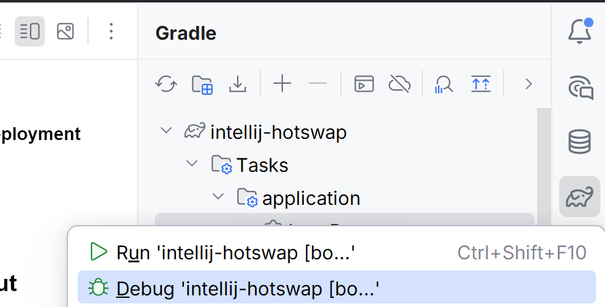
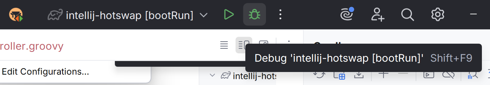
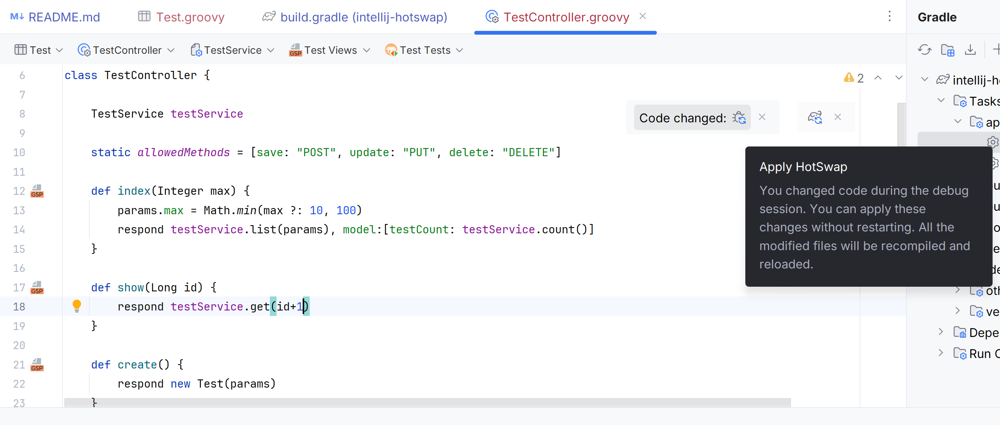
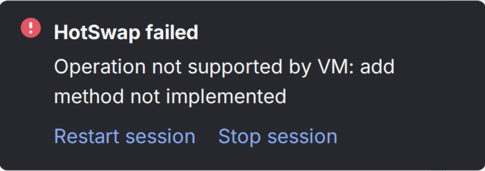
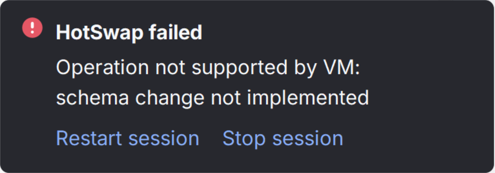

## IntelliJ IDEA Enhanced HotSwap in Debug Mode

This guide explains how to configure and use IntelliJ IDEA's HotSwap feature for rapid development with your Grails project. HotSwap allows you to modify code and see changes immediately without restarting the server.

### 1. Configure HotSwap Settings

Navigate to **Settings/Preferences > Build, Execution, Deployment > Debugger > HotSwap** and configure:

- Check **"Build project before reloading classes"** - Ensures code is compiled before hot-swapping
- Set **"Reload classes after compilation"** to **"Always"** - Automatically applies changes after compilation
- Check **"Enable hot-swap agent for Groovy code"** - Required for Groovy/Grails hot-swapping support

### 2. Configure Gradle as Build Tool

Navigate to **Settings/Preferences > Build, Execution, Deployment > Build Tools > Gradle** and set:

- **"Build and run using"** to **"Gradle"** - Uses Gradle for building the project
- **"Run tests using"** to **"Gradle"** - Uses Gradle for test execution

### 3. Enable Automatic Compilation

Navigate to **Settings/Preferences > Build, Execution, Deployment > Compiler** and:

- Check **"Build project automatically"** - Enables background compilation when files are modified

### 4. Run the bootRun Task in Debug Mode

Launch the Gradle `bootRun` task in debug mode using any of these methods:

**or**

**or**

### 5. Edit Existing Methods

You can modify existing methods in controllers or services while debugging:

- After editing and saving, IntelliJ will prompt you to **Apply HotSwap Changes**
- Click the prompt to reload the modified classes
- Refresh your browser to see the changes reflected immediately

### 6. Adding New Components

When adding new domains, controllers, services, and views, create them in the following order:

1. **Domain** - Define your domain model first
2. **Service** - Create services that use the domain
3. **Controller** - Create controllers that use the services
4. **Views** - Add corresponding GSP views

**Important:** All methods must be present in each file when first saved. Adding methods to existing classes after the initial save requires a server restart.

**Note:** The `generate-all` command currently creates controllers before services, which requires a server restart, since the controller fails to compile due to missing service methods.

### Limitations

Using Jetbrains' Runtime and jvmArgs `-XX:+AllowEnhancedClassRedefinition` overcomes some of these limitations.

#### Adding Methods Not Supported

Adding new methods to existing classes after initial creation requires a full server restart:

#### Domain Changes Require Restart

Domain class modifications are not supported by HotSwap and require a server restart:

- **Constraint changes** - Not applied without restart
- **Field/Schema changes** - IntelliJ will display a restart dialog when detected

**Tip:** Restarting the server is quick and can be done with a single click from the IntelliJ debug toolbar.
